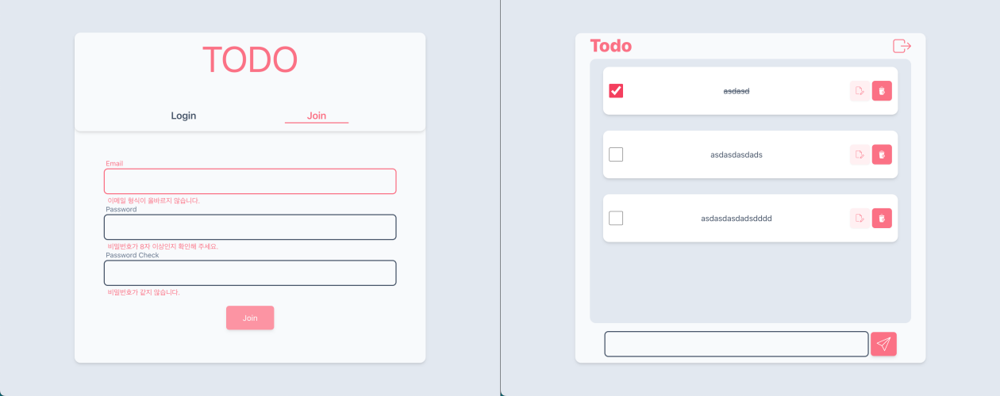

# wanted-pre-onboarding-frontend
<p align="middle">

</p>


## 목차
1. [사용 라이브러리](#사용-라이브러리)
2. [실행 방법](#실행방법)
3. [Demo](#demo)
4. [요약](#요약)
# 사용 라이브러리
* `tailwindcss`
* `tailwindcss-styled-component`
* `react router dom`
* `axios`
# 실행방법
```
yarn start
```
# Demo
* https://wanted-pre-onboarding-frontend-drab.vercel.app/

# 요약
```
src/
├── App.js
├── apis
│   ├── auth.js         // login, join 통신
│   ├── index.js        // axios 인스턴스
│   └── todo.js         // Todo 기능 통신
├── components
│   ├── RadioGroup.js
│   ├── account         // 로그인 페이지 component
│   │   ├── Account.js
│   │   ├── Join.js
│   │   └── Login.js
│   ├── common          // 재사용성을 고민한 일반 component
│   │   ├── Button.js
│   │   ├── Container.js
│   │   ├── Input.js
│   │   ├── PageTemplate.js
│   │   └── Radio.js
│   └── todo            // Todo 페이지 component
│       ├── ToDo.js
│       └── TodoCard.js
├── contexts
│   └── RadioContext.js
├── hooks               // 재사용성과 UI와 기능의 분리를
                        // 고민한 coustom hooks
│   ├── useAuthMethod.js
│   ├── useInput.js
│   ├── useLocalStorage.js
│   ├── useRequest.js
│   └── useTodo.js
├── index.css
├── index.js
├── pages               // 페이지를 정의
│   ├── AccountPage.js
│   └── ToDoPage.js
├── router              // router
│   └── Router.js
└── utils
    ├── Svg.js          // color, 크기 설정 가능한 Svg
    └── Validations.js  // Validation pattern
```
